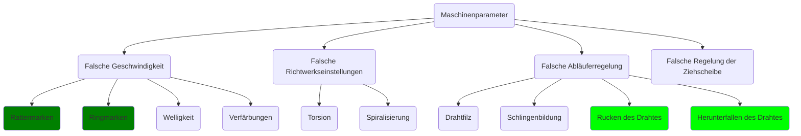
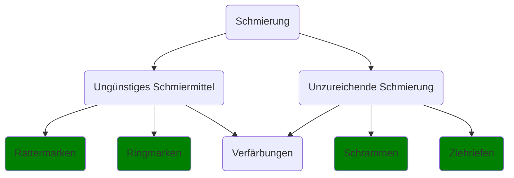
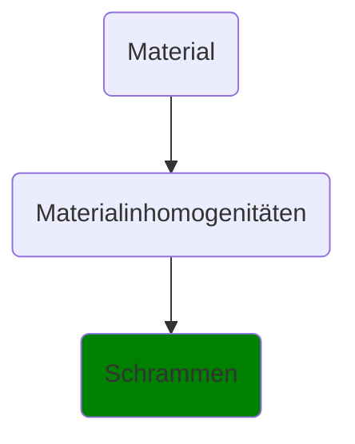
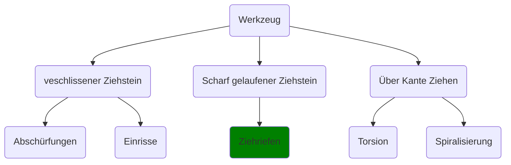
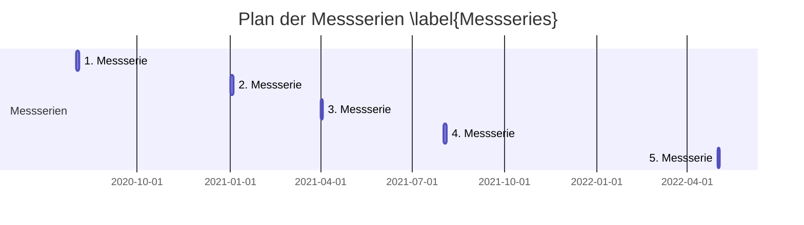
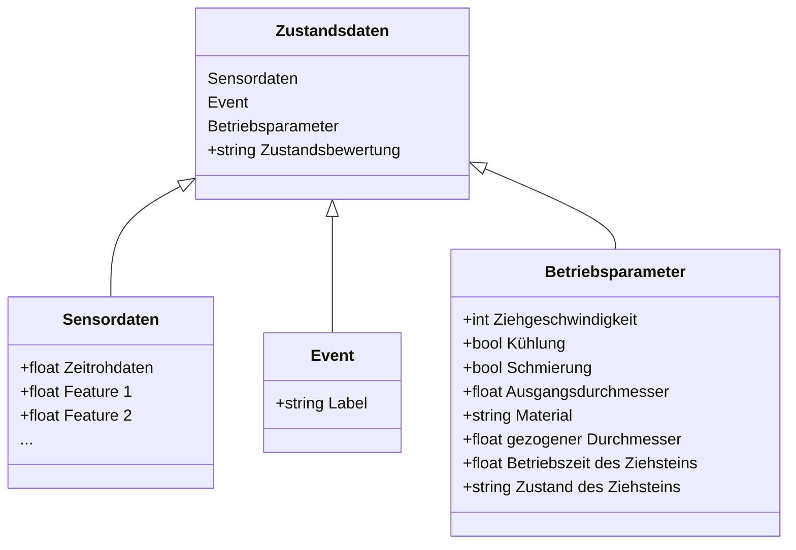

## Einleitung

- Ein Bauteil oder Werkzeug meldet sich automatisch bei Beschädigung oder Verschleiß, die Maschine bestellt selbständig neues Material.
- Zur Erfassung solcher Zustände werden moderne, smarte Sensoren benötigt.
- verfügbare Lösungen am Markt sind abhängig von der Applikation
- Prozessüberwachung, Optimierung und Qualitätsicherung für kostenoptimale und kundengerechte Drahtziehanlagen
- Condition Monitoring System um Störungen aus dem Klangbild der Maschine durch Signalanalyse zu extrahieren
- Feedback vom Maschinenverwender zu Kieselstein

## Wissenschaftlich-technische Ergebnisse und andere wesentliche Ereignisse

Angestrebt werden kundenspezifische Condition Monitoring Systeme die sich je
nach Funktionalität in Systembaukästen mit drei verschiedenen Umfängen
untergliedern lassen, wobei die größeren Pakete immer die Funktionalitäten der
kleineren Pakete beinhalten:

- Paket S (small)
  - Bereitstellung und Visualisierung der aufbereiteten Messdaten
  - Schnittstelle zur Messdatenübermittlung an den Hersteller
- Paket M (middle)
  - Fehleranalyse/-diagnosen
  - Handlungsempfehlungen
  - Schnittstelle zur Datenübermittlung an den Hersteller
- Vorbereitung zu Paket L (large)
  - Selbstdiagnose
  - Automatisierter Eingriff in die Maschinensteuerung
  - Wartungsempfehlungen
- Durch Low-Cost Sensorintegration, Bewertungsstudien, Merkmalsextraktion und -identifikation kombiniert mit effizienten Auswertealgorithmen soll diese Pakete umgesetzt werden.
- Entwicklungskerngebiete liegen im Bereich von Acoustic-Emission, das bisher nur für impulshaltige Geräusche verwendet wird.
- Überwachungsmethode entwickeln, die den Zusammenhang zwischen Maschinenparametern und Verschleißerscheinungen am Zieh-/Schälwerkzeug angemessen erklärt

### Anforderungs- und Zieldefinition

#### Zielsetzung

Die vom System zu erfassenden Zustände, Fehler und Daten werden eingegrenzt und klassifiziert. Des Weiteren wird bei der Bereitstellung der Daten unterschieden in Echtzeit, nach Notwendigkeit oder auf Abfrage. Im Entwicklungsprozess können sich weitere Anforderungen oder Randbedingungen ergeben, welche für eine spätere Übertragbarkeit auf weitere Anlagen mit zu erfassen sind.

#### Evaluierung relevanter Einflussgrößen sowie Erarbeitung einer Einflussmatrix

Ein Katalog der Betriebszustände und zugehöriger Fehlerbilder vom Projektpartner Kieselstein dient als Grundlage für die Einflussmatrix und die Auswahl der zu untersuchenden Störungen. Diesen hat AMITRONICS um eine Abschätzung zur Diagnosefähigkeit der Drahtzugfehler erweitert.
Auf der folgenden Abbildung (vgl. \ref{fehlerkat}) sind die Fehlerursachen gruppiert und die daraus folgenden Fehler sind dargestellt.
Die relevantetesten Fehler lassen sich auf die Maschinenparametern, die Schmierung, das Material oder auf das Werkzeug zurückführen. Als Projektziel wird die Detektion von Rattermarken, Ringmarken, Schrammen und Ziehriefen definiert. Daneben wird die Erkennung von Rucken des Drahtes und das Herabfallen des Drahtes angestrebt.
Rattermarken und Ringmarken lassen sich dabei entweder auf eine falsche Ziehgeschwindigkeit oder ein ungünstiges Schmiermittel zurückgeführt. Schrammen werden überwiegend durch eine unzureichende Schmierung oder Inhomogenitäten im Drahtmaterial verursacht. Eine unzureichende Schmierung oder ein scharf gelaufener Ziehstein können in Ziehriefen resultieren. Eine nicht optimale Abläuferregelung bewirkt ein Rucken oder Herabfallen des Drahtes.

Bei den ausgewählten Fehlern, die auf Abb. \ref{fehlerkat} grün markiert sind, wird eine detektierbare Veränderung des Körperschalls vermutet.

Für die Betriebsmessungen werden folgende Messserien geplant (vgl. \ref{Messseries}):

Bei allen Betriebsmessungen wird die Ziehgeschwindigkeit und weitere Betriebsparameter, wie die Kühlung und Schmierung, variiert. Zusätzlich wird neben dem regulären Ziehprozess, der Betrieb bei künstliche eingebrachten Störungen analysiert.

- **1. Messserie**
In der ersten Messserie werden Messungen zur Strukturanalyse und ein erster Sensorvergleich gemacht. Zwischen der ersten und der zweiten Messserie wird der Sensor der TUC und das vibroakustischem Messsystem von AMI weiter entwickelt.

- **2. & 3. Messserie**
Anhand der Ergebnisse der ersten Messungen werden geeignete Sensorpositionen ausgewählt. Ab der zweiten Messserie werden hochfrequente Acoustic Emission Messungen durchgeführt. Bei der zweiten und dritten Messserie werden verschiedene Drahtmaterialien verwendet.

- **4. & 5. Messserie**
In der vierten Messserie wird mit dem in die Ziehmaschine integrierten Sensor der TUC gemessen.
Zwischen den letzten beiden Messserien ist ein größer zeitlicher Abstand geplant, um alle Aufgaben und evtl. auftretende Verbesserungsmöglichkeiten umsetzen zu können.

Grundsätzlich lassen sich zwei Detektionsklassen unterscheiden: Schäden welche sich durch transiente Ereignisse kennzeichnen und andere, zumeist verschleißbedingte, welche zu einem dauerhaften Anstieg der Schallleistung führen.  Zur Ersteren zählen Knicke und Kerben im Draht und transiente Änderungen am Ziehstein, wie Ausbrüche.
Eine unzureichende Schmierung des Prozesses mit zu wenig Ziehseife lässt die Schallleistung hörbar ansteigen.  In Planungsrunden mit den Konsortialpartnern werden Störgrößen ausgewählt, welche sich synthetisch reproduzieren lassen. Zur Plausibilitätsprüfung werden natürlich verschlissene Werkzeuge herangezogen.  Zur realitätsnahen Abdeckung des Produktionsspektrums werden vorhandene Drahtcoils mit unterschiedlichen Zugfestigkeiten (C90 (Federstahl), 54SICR6, S235JR (Baustahl), 100CR6, X2CrNiMoN22-5-3 (Edelstahl)) verglichen.
Außerdem werden verschiedene Ziehgeschwindigkeiten, Einzugswinkel, Schmierzustände und Querschnittreduktionen untersucht.  Ein möglichst großer Abdeckungsbereich führt zu stabileren und damit praxisorientierten machine learning modellen.
Es gibt zwei wesentliche Drahtzugmethoden: Ziehen und Schälen.  Auf den Schälbetrieb wird verzichtet, da der Ziehbetrieb in der Industrie häufiger eingesetzt wird. Zusätzlich ergeben erste Messungen, dass die Störquellen im Körperschallsignal beim Schälen dominanter sind als im Ziehbetrieb. Denn der Materialabtrag und die zusätzlich benötigten Aggregate erzeugen Störgeräusche.  Dies ist beispielhaft in Abbildung \ref{noise_aggregats} an der Sensorposition 7, am Gehäuse der Ziehsteinkassette, dargestellt. (vgl. Betriebsmessungen_S7.png).

#### Definition der Funktionseinheiten

Beim Drahtziehen im Allgemeinen und durch Messpositionen nahe am Ziehstein muss die verwendete Messtechnik folgende Anforderungen erfüllen (vgl. Tabelle \ref{env}):

| Anforderung | Beschreibung |
|-|-|
| Temperatur | Die Oberflächentemperatur der Ziehsteinmatrix kann sehr heiß werden. Beim Ziehen mit mangelnder Schmierung oder bei ausgefallener Kühlung können Temperaturen bis ca. 140°C auftreten |
| Feuchtigkeit          | Die Sensoren und das Condition Monitoring System sollten gegen Spritzer geschützt sein, da diese in der Umgebung der Ziehmaschine nicht ausgeschlossen werden können. |
| Staub | Als Schmierung wird unter anderem pulverförmige Ziehseife verwendet. Beim Nachfüllen der Ziehseife treten regelmäßig Staubwolken auf. |
| Schlagfestigkeit | Leichte Stöße und Schläge auf die Sensorik und das Messsystem können bei Montagearbeiten an der Ziehmaschine nicht vermieden werden. Erschütterung durch Abrisse von Drähten unter extremen Betriebsparametern dürfen nicht zu Schäden führen. |

Table: Anforderungen an die Messtechnik \label{env}

Zur Vernetzung der Maschinensteuerung mit dem vibroakustischem Messsystem, kurz VAM, einer grafischen Benutzerschnittstelle und den Datenbanken wird der Industriestandard OPC UA gewählt [@opcfoundationOPCUnifiedArchitecture2014].
Dieses wird als modulares Interface implementiert, um die Verwendung anderer Protokolle zuzulasssen. Ein Pflichtenheft bezüglich der Hard- und Software zur Definition der Funktionseinheiten, welches die Komponenten, Schnittstellen und Anforderungen aller Projektpartner detailliert beschreibt wird erstellt. Das Gesamtsystem wird in Prozessleitebene, Komponentenebene und Sensorebene aufgeschlüsselt (vgl. Abb. \ref{Gesamtkonzept}). Durch die einzelnen Ebenen und möglichst allgemeine Schnittstellen wird ein sehr modulares Gesamtkonzept angestrebt. Das OPC UA Netzwerk kann um weitere OPC UA Server und Clients erweitert werden, die direkt an das lokale Netzwerk des Condition Monitoring Systems angeschlossen werden.

Um im Projekt eine frühe Verfügbarkeit der Informationen aus der Maschinensteuerung zu ermöglichen, wird diese durch AMI in einem gesonderten Prozess simuliert. Über eine Benutzerschnittstelle in Form einer Kommandozeileninterface (command line interface, CLI) können die Prozessparameter und Maschinendaten eingetragen werden, welche mit OPC UA gestreamt werden.
Die Informationen umfassen folgende Größen: Ziehgeschwindigkeit, Schmierung, Kühlung, Material, Ausgangsdurchmesser und reduzierter Durchmesser. Als konstante Metainformationen werden beispielhaft Maschinentyp,  Seriennummer, Einsatzort, Kundenname und der Hersteller für die spätere Verwendung beim Kunden hinterlegt.

AMI speichert die Messdaten und alle Metainformationen in SQL-Datenbanken auf File-Ebene mittels SQlite ab.[@SQLiteHomePage] Als Datenformat wird das in pywaveline definierte Format gewählt, welches auf Basis der FLAC-Komprimierung von Audiodateien und bezüglich der Zugriffszeiten und hoher Abtastraten mit bis zu 10 MHz optimiert ist. [@WaveLineWavelineDocumentation, @FLACWhatFLAC]
Das Interface zur Hardware und die Verarbeitungspipeline wird durch AMI entwickelt. Die Verarbeitung der Daten erfolgt parallel in separaten Prozessen. Bei dem entwickelten Condition Monitoring System, sollen final nur die Features berechnet werden, welche die wesentlichen Merkmale zur Identifikation von vorliegender Störgrößen beinhalten. Diese dienen als Eingangsgröße für die Machine Learning Modelle zur Zustandsbewertung. Eine Darstellung der Features erfolgt mittels einer modularen GUI (vgl. das Kapitel Konzipierung der CMS Pakete).
Durch die modulare und parallele Vorgehensweise ist die Einhaltung der Echtzeitfähigkeit nur von der Berechnung der Features abhängig. Komplexe Features müssen ggf. verzögert und nur bei Bedaruf ausgewertet werden.
Zur zeitlichen Markierung von transienten Ereignissen während einer Messung setzt AMI eine weitere CLI ein. In einem Konfigurationsfile sind bekannte Events vordefiniert, bei Auswahl wird die ID des Events mit dem Zeitstempel in der Datenbank hinterlegt. Dadurch können die Messdaten live gelabelt und damit für maschinelles Lernen vorbereitet werden. Beispielsweise kann somit der Zeitpunkt, wenn eine künstliche erzeugte und farblich markierte Kerbe den Ziehstein passiert, erfasst werden.

Die Struktur der Kommunikation ist auf Abbildung \ref{KommuStruktur} dargestellt.
Die Zustandsdaten, die als Eingangsgröße für die Machine Learning Modelle verwendet werden, setzen sich aus den zeitlich synchronisierten Sensordaten, Daten der Events und den Betriebsparametern zusammen. Mit diesen Daten wird der aktuelle Zustand bewertet.
Die Sensordaten umfassen die Zeitrohdaten und Features, die auf Basis der Zeitrohdaten berechnet werden.
Die Benutzereingabe des aktuellen Events wird zum Training der Modelle verwendet.
Neben den Sensordaten werden alle Betriebsparameter, wie unteranderem die Ziehgeschwindigkeit, die Kühlung, die Schmierung, zu den Zustandsdaten zusammengefeasst.

\label{KommuStruktur}

### Umfassende strukturdynamische Analyse der Versuchsanlage zur Charakterisierung der relevanten Maschinen- und Prozesszustände

#### Zielsetzung

Ziel ist es das Körperschallübertragungsverhalten der Versuchsanlage, beschrieben durch Eigenfrequenzen, Dämpfungen und Eigenschwingformen, mittels einer experimentellen Modalanalyse zu beschreiben, um so die idealen Sensorpositionen zu ermitteln. Betriebsschwingungsmessungen werden zur Schwachstellenidentifikation und zur Bestätigung der Sensorauswahl herangezogen. Referenzspektren für verschiedene Prozesszustände sollen den Fehlerkatalog erweitern und die Fehler akustisch beschreibbar machen.

#### Acoustic Emission Analyse

Die Vorauswahl der Sensorpunkte wird an den geometrischen Randpunkten der Struktur so gewählt, dass eine möglichst steife Anbindung bei geringen Nichtlinearitäten sichergestellt werden kann. Hierzu wird im ersten Schritt eine Bauraumanalyse an einem CAD Modell der Maschine gemacht. Die komplette Ziehmaschine ist auf Abb. \ref{Ziehmaschine} dargestellt. Genauer wird die Ziehmatrix auf Abb. \ref{Ziehmatrix} ersichtlich. Als geeignete Sensorpositionen werden Positionen nahe an der Ziehmatrix vorausgewählt (vgl. \ref{Strukturanalyse}).

Da die Versuchsanlage einen massereichen Aufbau und eine hohe Steifigkeit aufweist, ist eine externe Anregung mit ausreichend hoher Amplitude in den gemessenen Beschleunigungssignalen aufwendig in der Umsetzung. Eine qualitative Untersuchung zeigt, dass die Strukturresonanzen für die Untersuchungen im Ultraschallbereich nur eine untergeordnete Rolle spielen. Das Schwingungsverhalten der Versuchsanlage und die gewählten Sensorpositionen werden in einer umfangreichen Betriebsschwingungsmessung analysiert. Eine Flächenbeitragsanalyse wird durch die Betrachtung von Übertragungsfunktionen zwischen verschiedenen Messpunkten ersetzt.
Die AMI entscheidet sich an Stelle einer vertieften Modal- und Eigenfrequenzanalyse den Fokus auf die Betriebsschwingungen im hochfrequenten Bereich zu legen. Die Ermittlung der Bewertungskenngrößen ist in diesem Bereich besser geeignet.
Zum Einstieg werden Acoustic Emission Messungen auf Basis des HSU-Nielsen-Test an verschiedenen Messpunkten durchgeführt. Dieser Test wird auch als "Bleistiftminentest" bezeichnet. Dabei wird beim Brechen einer Bleistiftmine mit definierter Länge und Abbrechwinkel ein reproduzierbarer Nadelimpuls erzeugt. Die Impulsfunktion entspricht näherungsweise einer Dirac-Funktion, welche eine stetig, lineare Impulsantwort im Spektrum erzeugt. Durch mehrere Mittelungen und einen definierten Bruchvorgang kann die Amplitude als Referenzwert für die korrekte Funktionsweise der AE-Sensoren und zur Bestimmung des Übertragungsverhaltens verwendet werden. Bei Acoustic Emission Sensoren wird im Gegensatz zu Beschleunigungsaufnehmern die Eigenfrequenz des Piezokristalls genutzt, womit der Frequenzgang nicht linear ist. Zur Bestimmung des relevanten Frequenzbereichs werden Acoustic-Emission Hits (transiente Burstsignale) gemittelt und mit dem Ruhepegel verglichen. Die abgebildeten AE-Events werden durch Kerben im Draht erzeugt. Der Ruhepegel zeigt die Resonanzfrequenz des Sensors bei 150 kHz und die Geräusche der Aggregate unterhalb von 100 kHz. Die Impulsantworten der Kerben sind im Frequenzbereich mit ausreichendem Signalrauschabstand (von 20 dB) bis etwa 400 kHz sichtbar. Daher wird eine obere Frequenzgrenze von 400 kHz und damit eine Abtastrate von 1 MHz festgelegt (vgl. \ref{Ruhepegelabgleich}).

#### Betriebsschwingungsmessungen

Der Umformvorgang des Drahtes findet innerhalb des Ziehsteins statt. Damit stellt die lokale plastische Verformung die Hauptschallquelle und den Entstehungsort der Burst Signale dar. Deshalb sollten die Sensoren so nahe wie möglich am Ziehstein angebracht werden. Im weiteren Projektverlauf wird der Sensor der TU Chemnitz direkt in eine Nut in der Ziehsteinmatrix eingepresst. Für eine hohe Vergleichbarkeit bei den ersten Messungen (Messserie 2 & 3) wird der Sensor der TU Chemnitz seitlich an die Ziehsteinmatrize mittels Magnethalter befestigt. Der Referenzsensor (Pos. 3 auf \ref{Strukturanalyse}) wird zum späteren Abgleich der Messsignale durch Magnetbügelhalter an der Matrize montiert. Die Messungen an den gewählten Sensorpositionen werden sowohl mit als auch ohne Draht durchgeführt. Die spektralen Leistungsdichten des Normalbetriebs mit Störungen (vgl. \ref{Spek_Leistdict}) werden zur Validierung der Sensorpositionen herangezogen. In der Abbildung entsprechen die Nummern der Sensoren VS900 den Sensorpositionen. Der Sensor 1 der TU Chemnitz befindet sich an Sensorposition 5 und der Sensor 2 der TUC an Position 6. An dem Messpunkt 7 ist der VS150M montiert. Insgesamt sind 8 Sensoren an der Versuchsanlage montiert. Davon sind fünf VS900, ein VS150, sowie zwei erste Testsensoren der TU Chemnitz appliziert.

Wobei die Nomenklatur der kommerziellen Sensoren die Resonanzfrequenzen bei 900kHz und 150kHz beschreibt. An Sensorposition 1, der Trommelanbindung, gibt es keine zeitliche Korrelation zur Störung. Gleiches gilt an Position 2, der Schälsteinmutter. Im Messsignal des Sensors VS900 an der zukünftigen Messposition S3 sind Kerben im Draht erkennbar. Bei dieser Messung zeigt der Sensor 1 der TU Chemnitz keine zeitlichen Ereignisse, sondern ein verrauschtes Frequenzspektrum über den gesamten Zeitverlauf. TU Chemnitz Sensor 2 hat hier noch Probleme im hochfrequenten Bereich. Der Sensor VS150M ist bei dieser Messung fehlerhaft.
Mit Betriebsschwingungsanalysen kann die Anregung der einzelnen Aggregate separat an mehreren Messpunkten ausgewertet werden. Eine Superposition der Haupt- und Nebenschallquellen zeigt die relevanten Betriebsschwingformen und die Verschiebung der vorherrschenden Resonanzfrequenzen (vgl. \ref{noise_aggregats}). Diese Analyse wird mit Triax-Beschleunigungssensoren im Frequenzbereich bis 5 kHz durchgeführt. Die größte Amplitude (über alle Messpositionen), exemplarisch an S7 dargestellt, tritt während dem Betrieb des Spänebrechers auf. Der Schälbetrieb und Späneförderungsbetrieb ist in der Amplitude und den Betriebsschwingformen vergleichbar. Die Kühlung, Hydraulik und Schmiermittelaggregate sind in der Amplitude vernachlässigbar. Da diese Komponenten sowohl beim Ziehen als auch beim Schälen aktiv sind, ist es vorteilhaft, dass ihr Störgeräuscheinfluss nicht dominant ist. Der Ziehbetrieb zeigt Strukturresonanzen mit deutlich geringerem Grundrauschen. Aufgrund dieser Erkenntnis und der höheren Praxisrelevanz wird im Folgenden nur der Ziehbetrieb weiter analysiert.

Um die Transferfunktion zwischen Draht und dem Sensor an der Matrize zu bestimmen wird der HSU-Nielsen Test verwendet. Als Anregungspunkte werden mehre Positionen am Draht und der Versuchsanlage verwendet. Pos. 0 mm ist an der Ziehsteinkassette direkt am Sensor. Die weiteren Punkte sind entgegen der Laufrichtung des Drahtes mit Koordinatenursprung an Pos. 0 mm angegeben. Die Kopplungsimpedanz zwischen Draht und Ziehstein führt zu einer Amplitudenverringerung von 20 dB über das gesamte Spektrum. Weitere Dämpfungen treten über erhöhten Abstand zum Sensor auf (vgl. \ref{Abkling1}).

Durch Anregung am Maschinenfundament und am Drahtcoil kann gezeigt werden, dass Umgebungseinflüsse aufgrund hoher Dämpfungen vernachlässigbar sind (vgl. \ref{Abkling2}).

Schädigungen am Draht werden innerhalb der 1. Messserie aufgezeichnet, diese sind aufgrund von Messsystemgrenzen nur bis 50 kHz auswertbar. Für folgende Messtermine wird daher ausschließlich das VAM Messsystem eingesetzt.

Die synthetisch erzeugten Störungen sind dennoch bereits sehr gut ersichtlich (vgl. \ref{SpekBetriebStoer}). Innerhalb der zweiten und dritten Messserie werden unterschiedliche Drahtdurchmesser und Werkstoffe, bei verschiedenen Vorschubgeschwindigkeiten mit und ohne Störungen abgefahren.

Für die Analyse des Luftschallverhaltens der Ziehmaschine wird synchron zu dem VAM mit Mikrofonen an einem weiteren Messsystem der Luftschall aufgenommen (vgl. Abb. \ref{Mess_6_Aufbau}).

Der Informationsgehalt der Mikrofone bietet keinen Mehrwert gegenüber den AE-Sensoren. Das eigens entwickelte zweite Messsystem wird dabei mit neuer Hardware und den Softwarekomponenten des VAM-Systems ausgestattet, was deren Modularität ausreichend bestätigt.

Während der Messung stellt sich heraus, dass das Labeln der Features für das machinelle Learning schwierig ist. Der aktuelle Verschleiß des Ziehsteins und die aktuelle Menge an Schmierung können nicht objektiv bewertet werden. Zur Untersuchung des Ziehsteins müsste dieser ausgebaut werden, was für eine Inspektion in kurzen Zeitintervallen unpraktikabel ist. Die Schmierung kann nicht schlagartig abgeschalten werden, da auch bei entfernter Schmierung noch Reste im Ziehstein verbleiben können. Und man deshalb erst nach einem weiteren Betrieb davon ausgehen kann, dass die Schmierung komplett entfernt ist.
Für eine durchgehende, objektive Qualitätsbeurteilung des gezogenen Drahtes wird in Mehrleistung im Rahmen der dritten Messserie mit einer Hochgeschwindigkeitskamera der gezogenen Draht gefilmt (vgl. Abb. \ref{Mess6_Kamerapos} und Abb. \ref{Mess_6_Aufbau}).

Anhand der Aufnahmen sollten Qualitätsfehler zeitlich den Messdaten zugeordnet werden. Mit erheblichen Aufwand wurde der Aufnahmestart der Kamera mit dem Messstart synchronisiert. Leider stellte sich heraus, dass die Reflexion der benötigten Beleuchtung und Schmierstoffreste auf dem Draht keine zuverlässige Qualitätsbeurteilung zulassen.
Für die Qualitätsanlyse wird der Draht im Stillstand an einigen Stützstellen  mikroskopisch untersucht. Über den Abstand der Stützstellen und einer farblichen Markierung der Start und Stops auf dem Draht können diese Stützstellen ungefähr mit den Messdaten synchronisiert werden (vgl. Abb. \ref{DrahtMikro1} und Abb. \ref{DrahtMikro2}).

Zusätzlich werden die Ziehsteine vor den Messungen und danach mit dem Mikroskop untersucht (vgl. Abb. \ref{ZiehsteinAnalyse}).

Die Obefläche der Drahtstücke der letzten Messserie werden ferner von der TU Chemnitz vermessen.

#### Überprüfung der Algorithmen

Für die folgenden Analysen wird nun ausschließlich das Signal des VS150M, der oben auf der Ziehsteinmatrix (S3) befestigt ist, verwendet. Die Messdaten werden als RMS mit einer Blockgröße 65536 Abtastpunkten zusammengefasst. Das entspricht einer Zeitdauer von 26 ms bei einer Abtastfrequenz von 2,5 MHz. Die eingestellte Blockgröße wurde empirisch ermittelt.
Zu Beginn wird der Einfluss der Ziehgeschwindigkeit auf den RMS untersucht (vgl. Baustahl_Vergleich_RMS_beschaedigter_Ziehstein.png) Für diese Messungen ist das Drahtmaterial Baustahl und der Ziehstein ist durch Riefen künstlich beschädigt. Dargestellt sind Messungen mit Ziehgeschwindigkeiten von 30, 60, 90 und 120 m/min. Es ist erkennbar, dass mit höheren Ziehgeschwindigkeiten, der RMS dauerhaft einen höheren Wert annimmt. Da während dem Ziehprozess mit beschädigtem Ziehstein Schwankungen auftreten, ist der RMS-Wert über die Dauer die Messung nicht konstant. Es wird ersichtlich, dass der RMS-Wert nicht proportional mit der Ziehgeschwindigkeit zunimmt. Bei höheren Ziehgeschwindigkeit ist der Anstieg des RMS geringer, obwohl die Geschwindigkeit um den gleichen Betrag erhöht ist.

Die zweite Darstellung des RMS, zeigt diesen für Betriebsmessungen beim Ziehen von Baustahl bei 30 m/min. Vergleichend sind Messungen im Gesundzustand, bei Kerben im Ausgangsdraht und bei einem beschädigtem Ziehstein gezeigt. Der beschädigte Ziehstein verursacht einen deutlich erhöhten RMS-Wert. Dagegen kann durch eine Betrachtung des quadratischen Mittelwertes nicht zwischen dem Gesundzustand und einem Ziehprozess mit einzelnen Kerben im Draht unterschieden werden. Abschließend wird eine Analyse des RMS hinsichtlich der Auswirkung von verschiedenen Drahtmaterialien (vgl. Vergleich_RMS_Ziehmaterialien.png) durchgeführt. Für diese Messung wird mit einem Vorschub von 30 m/min gezogen und der Ziehstein ist unterschiedlich stark beschädigt. Für die verschiedenen Materialien sind in dieser Messreihe keine gleichen Ausgangsdurchmesser vorhanden. Deshalb ist die Reduktion des Durchmessers unterschiedlich. Der Baustahl wird von 4 mm auf 3,36 mm Durchmesser gezogen (Differenz: 0,64 mm), der Edelstahl von 7,7 auf 7,16 mm (Differenz 0,54 mm) und der Draht aus Federstahl von 9,1 auf 8,4 mm (Differenz 0,7 mm). In der Darstellung zeigen sich Einflüsse diverser Parameter (Durchmessreduktion, Drahtmaterial und Ziehsteinstörung), daher ist ein direkter Vergleich nicht möglich. Hierfür ist eine weitere Reduktion der Parameter notwendig, wozu eine neue Messreihe notwendig ist.

Zusätzlich zu den Messungen der Betriebsschwingungen wird durch mehrere HSU-Nielsen-Tests entlang des eingespannten Drahtes, beginnend von der Matrize, eine Abklingkurve der Wellenpakete erstellt (vgl. Abklingkurve_Amplitude.png, Abklingkurve_Energie.png). Die Drahtzugmaschine und alle Nebenaggregate sind während der Messung abgeschaltet und der Draht ist vorgespannt. Die Abbildungen stellen die gemessene Amplitude und den Energieinhalt einer Anregung in Abhängigkeit vom Anregungsort zum Sensorort da. In Kombination mit der gemessenen Amplitude der Störgeräusche, kann bestimmt werden bis zu welchem Abstand zum Sensor ein Ereignis von den Störgeräuschen unterscheidbar ist. Als Sensor wird ein VS150M an der Pos. 3 verwendet.

##### Lösungsansätze zur Zustandsüberwachung

Um den Drahtziehprozess zu überwachen werden im industriellen Umfeld sowie in der Forschung unterschiedliche Lösungsansätze und Methoden verwendet. Neben optischen Systemen, welche sich zur Prozessüberwachung auf kamerabasierte Sichtsysteme[@larsson_process_2017] oder Wärmesicht[@larsson_monitoring_2019] stützen, exisiteren auch durch Virbationssensorik[@pejryd_process_2017] gestützte Überwachungsverfahren. Diese Lösungsansätze unterscheiden sich in der Herangehensweise, fokussieren aber die für die Überwachung des Drahtzugprozesses obligatorische Schmierung des Drahtes. Eine fehlende Schmierung kann zu Materialschäden bzw. Schäden an der Drahtoberfläche führen, welche sich in Form von Rissen oder Kerben manifestieren. Da eine ausbleibende Schmierung sowie die Verletzung der Oberflächenintegrität des gezogenen Drahts auch zu veränderten Schallemissionen führt, wird der Drahtzugprozess seitens AMI über die detektieren Schallereignisse überwacht.

- Acoustic Emission Sensoren -> reduzierte Hintergrundgeräusche in diesem Frequenzinterval (evtl. Plot der dies bei der Drahtziehmaschine zeigt)
- aus Antrag -> Ziel: Erweiterung des höhrbaren Bereichs des Maschinenbedieners -> Informationen aus höherfrequenten Bereich
- vergleichbar mit dem Sensor der TUC?
- Informationen auch im hochfrequenten Bereich -> Spektrogramm plotten

Periodische Prozessfehler sind beispielsweise Rattermarken und Ringmarken.
Diese werden durch einen falschen Geschwindigkeitsbereich oder eine ungünstige Schmiermittelwahl verursacht.
Um diese Fehler zu provozieren werden während den Messungen verschiedene Geschwindigkeiten über den gesamten möglichen Bereich gewählt.
Eine ungünstige Schmiermittelwahl wird über zu wenig bis gar keine Schmierung nachgestellt.
Ferner werden beide Ursachen kombiniert.
Dennoch treten bei den Messungen nur sporadisch Rattermarken oder Ringmarken auf.
Da ihre Anzahl sehr gering ist, können die entwickelten Machine-Learning Modelle nicht ausreichend trainiert werden, um diese wiederholbar zu detektieren.
Zur Extraktion der relevanten Merkmale innerhalb der gesammelten Messdaten werden verschiedene Metriken im Zeit- und Frequenzbereich angewendet.
Im ersten Schritt werden die Messungen der künstlichen Kerbschläge im Baustahl (S235JR) analysiert.
Im Zeitbereich kann durch den Crest-Faktor (Peakamplitude/RMS), Impulsfaktor (Peak/Mittelwert) und Margin(Peak/ Quaddratwurzel der Absolutwerte) die Impulshaftigkeit für die Messblöcke untersucht werden.
Jeder Messblock hat vergleichbar zur RMS-Auswertung eine Dauer von 26 ms.
Bei einer Ziehgeschwindigkeit von 30 m/min und einem Kerbabstand von 2 cm haben die Impulse einen Abstand von 40 ms.
Dadurch liegt in jedem Block nur ein Impuls vor.
Die Auswertung zeigt, dass zwischen den Blocknummern 2000 und 2500 die höchste Impulshaftigkeit vorliegt.
In diesem Bereich liegen auch die eingeschlagenen Kerben.
Dennoch werden auch außerhalb dieses Bereichs Impulse festgestellt, welche eine hohe Impulshaftigkeit aufweisen.
Das liegt am sporadischen Anschlagen des Drahts auf dem Boden und den Einzugsrollen.
Features im Frequenzbereich sollen die Erkennung der Kerben verbessern.
Das gelingt mit einer Berechnung des HFC (High Frequency Content), welcher hauptsächlich zur Onset-Erkennung in Musikstücken eingesetzt wird.
Hier werden die Kerben mit einer höheren Amplitude gegenüber anderen Impulsen sichtbar.
Beim Anfahren der Maschine liegt ebenfalls ein Impuls mit sehr hochfrequentem Anteil vor, welcher falsch erkannt werden würde.
Daher müssen mehrere Features berücksichtigt werden.
Im Anschluss werden diese Features mit Varianzanalysen und weiteren statischen Methoden auf ihre Unabhängigkeit untersucht.
Die besten Features werden für die Entwicklung der ML-Modelle herangezogen.

> Meilenstein 1: Die Sensorpositionen wurden definiert und die handelsübliche Hardware implementiert und getestet. Die elektronischen Schnittstellen werden im Laufe des AP 5 finalisiert.

## Algorithmenentwicklung

### Auswerten der Messdaten mit den entwickelten Algorithmen <!-- AP4.1 -->

Die meisten psychoakustischen Features können nicht direkt für Acoustic-Emission Messungen angewendet werden, da diese für den vom Menschen hörbaren Bereich definiert sind. Und bei AE-Messungen wird der Frequenzbereich bis in den Megahertzbereich berücksichtigt, der deutlich über dem hörbaren Bereich, von 20 Hz - 20 kHz, liegt.
Die Begrenzung der psychoakustischen Features auf den hörbaren Bereich begründet sich dadurch, dass auf Basis objektiv erfassbarer, physikalische Größen und unter Berücksichtigung des menschlichen Gehörs, psychoakustischen Kennwerte bestimmt werden. Ein Beispiel für ein psychoakustisches Feature wäre die A-Bewertung, bei der das Spektrum der gemessenen Schalldruckpegel mit einer frequenzabhängigen Gewichtung, die dem menschlichen Gehör nachempfunden ist, multipliziert wird [@ArbeitsringLarmDEGA].
Als signalanalytische Merkmale für die Zustandsüberwachung der Drahtziehanlagen werden deshalb Kennwerte, die an die psychoakustischen Features angelehnt sind, verwendet. Zusätzlich werden die üblichen Kennwerte, wie RMS, Peakamplitude und weitere verwendet.
Zur Beurteilung der Impulshaftigkeit des gemessenen Signals werden folgende Features verwendet: Crest-Factor, K-Factor, Impulse-Factor, Margin-Factor, Shape-Factor, Clearance-Factor, Kurtosis, Skewness [@SignalFeaturesMATLAB, @caesarendraReviewFeatureExtraction2017]. Die Impulshafigkeit kann objektiv zur Zustandsüberwachung verwendet werden und ist ein übliches psychoakustisches Merkmal [@yannikPsychoakustikPsychoakustikEffekte].
Neben der Impulshafigkeit des Signals wird die Schärfe berücksichtigt, bei der der hochfrequente Energieanteil mit der Gesamtenergie des Signals verglichen wird [@SoundQualityAlgorithms, @kaneApplicationPsychoacousticsGear2016].

Die Erkennung des Referenzzustands und die Abweichung von diesem während des Drahtziehprozesses entspricht thematisch dem Aufgabenbereich der Anomalieerkennung und bildet die erste Stufe des KI-gestützten Analyseverfahrens.
Für die darauffolgende zweite Stufe des Anaylseverfahrens, die Einteilung bzw. Zuordnung in vordefinierte Abweichungen oder Schadenstypen, ist ein geeignetes Klassifikationsverfahren nötig.
Beide Teilstufen lassen sich mit Hinblick auf die Minimierung des Rechenaufwands zu einer zusammenhängenden Architektur aus neuronalen Netzen vereinigen.
Für die erste Stufe wird ein Auto Encoder verwendet, welcher in \ref{} genauer beschrieben wird.
Die zweite Stufe verwendet ebenfalls ein neuronales Netz, welches die bereits komprimierten Informationen (vgl. Abb. \ref{fig:}) der ersten Stufe nutzt, um eine eindeutige Zuordnung des fehlerbehafteten Prozesses durchzuführen.

Für die Darstellung auftretender Fehler wird eine GUI verwendet. Diese wird im Laufe des Projekts stetig weiterentwickelt. Dabei fließen bei Abstimmungsmeetings und den Messterminen, das Feedbeck aller Projektteilnehmer ein. Durch den Einsatz bei den Messungen kann die Eignung in der Praxis aus Sicht der Messingenieure, des Maschinenbedieners und der Softwareentwickler validiert werden.

Für die Analyse der Auswirkungen verschiedener Drahtmaterialien auf die Acoustic Emission Signale werden folgende Betriebsmessungen verglichen (vgl. Tabelle \\ref{tab:paras_draht_analyse}):

| Kurzbezeichnung | Drahtmaterial | Ziehgeschwindigkeit [m/min] | Schmierung | Kühlung | Zustand des Ziehsteins | Ausgangsdurchmesser [mm] | Gezogener Durchmesser [mm] | Durchmesserreduzierung [mm] |
| --------------- | ------------- | --------------------------- | ---------- | ------- | ---------------------- | ------------------------ | -------------------------- | --------------------------- |
| Baustahl 1      | Baustahl      | 30                          | vorhanden  | ein     | Referenzzustand        | 4,00                     | 3,36                       | 0,64                        |
| Baustahl 2      | Baustahl      | 30                          | vorhanden  | ein     | künstlich verschlissen | 4,00                     | 3,36                       | 0,64                        |
| Edelstahl       | Edelstahl     | 30                          | mangelhaft | ein     | Ringverschleiß         | 7,70                     | 7,16                       | 0,54                        |
| Federstahl 1    | Federstahl    | 30                          | mangelhaft | ein     | Referenzzustand        | 9,1                      | 8,4                        | 0,7                         |
| Federstahl 2    | Federstahl    | 30                          | mangelhaft | ein     | Referenzzustand        | 9,1                      | 8,4                        | 0,7                         |
| Federstahl 3    | Federstahl    | 30                          | mangelhaft | ein     | Referenzzustand        | 9,1                      | 8,4                        | 0,7                         |

Table: Parameter der Betriebsmessungen zur Analyse des Einflusses des Drahtmaterials \label{tab:paras_draht_analyse}

Als Drahtmaterialien werden Baustahl, Edelstahl und Federstahl verwendet. Alle Materialien werden mit 30 m/min gezogen und bei allen Betriebsmessungen ist die Kühlung des Ziehsteins eingeschalten. Nur Baustahl wird mit Schmierung gezogen und die beiden anderen Materialien mit einer Mangelschmierung. Da nicht alle Drahtmaterialien mit dem gleichen Ausgangsdurchmesser verfügbar sind und die Zustände der Ziehsteine unterschiedlich sind, spielen diese beiden Parameter, der Schmierzustand und das Drahtmaterial in die Vergleichsdaten. Für alle Messungen wird mindestens 45 s der stationäre Ziehprozess gemessen. Um die Vergleichbarkeit zu erhöhen werden für Baustahl zwei und für Federstahl drei verschiedene Betriebsmessungen ausgewertet. Für Edelstahl liegt nur eine Betriebsmessung mit der gewählten Ziehgeschwindigkeit vor.

Um den Einfluss von singulären Ereignissen zu minimieren, werden die Featurewerte statistisch ausgewertet. In Abbildung \ref{fig: amp_material} sind der Minimalwert, der Mittelwert, die Standardverteilung, der Maximalwert und die 25%, 75% und 90% Quantile für die Betriebsmessungen mit verschiedenen Drahtmaterialien dargestellt. Die statistischen Werte, bis auf die Standardverteilung und der Maximalwert, der Amplitude liegen für Edelstahl deutlich unter den Werten für Baustahl und Federstahl. Die Minimalwerte, die Mittelwerte, die Maximalwerte und die Werte bis zum 75% Quantil liegen für Baustahl unter den entsprechenden Werten für Federstahl. Die statistischen Werte für Federstahl sind alle am höchsten. Der Abstand zwischen Baustahl und Federstahl ist deutlich geringer als zwischen Baustahl und Edelstahl. Die Maximalwerte, die für die drei Materialien ähnlicher sind als die anderen statistischen Werte, sind für eine Analyse bedingt geeignet, da diese auf singuläre Ereignisse, wie Unregelmäßigkeiten beim Abrollen oder der Zuführung des Drahtes, zurückzuführen sind. Die Standardverteilung der Peakamplitude lässt ebenfalls keine Rückschlüsse auf das verwendete Drahtmaterial zu.
Dagegen der Minimalwert, der Mittelwert und die Werte bis zum 90% Quantil der Amplitude lassen auf das verwendete Drahtmaterial zurück schließen.

Die gleichen Ergebnisse gelten für die statistischen Werte des hochfrequenten Anteils und den root-mean-square (RMS).
Auf alle Features lassen sich die Ergebnisse nicht übertragen, beispielsweise auf den Spektralen Schwerpunkt und die spektrale Peakamplitude.
Bei den statistischen Werten des Frequenzwertes der spektralen Peakamplitude ist der Minimalwert ungeeignet für eine Unterscheidung des Drahtmaterials, der Mittelwert und die Quantile dagegen schon.
In Abbildung \ref{fig: spek_material} sind die Spektren für die Messungen der unterschiedlichen Ausgangswerkstoffe gezeigt. Die Amplitudenwerte im Spektrum für Federstahl deutlich am höchsten, mit einem durchschnittlichen Abstand einer Zehnerpotenz zu Baustahl. Die Werte für Baustahl sind größtenteils höher als die Werte der Messung von Edelstahl, der Abstand beträgt aber im Frequenzbereich ab 200 kHz bis 500 kHz zwischen 1*e-8 V und 1,6 e-6 V.
Im Frequenzbereich von ca. 100 kHz bis 650 kHz kann anhand der Amplitudenwerte Federstahl eindeutig von den beiden anderen Materialien unterschieden werden. Eine Unterscheidung zwischen Baustahl und Edelstahl ist in den Frequenzbereichen 40 kHz bis 200 kHz, 250 kHz - 300 kHz, und ca. 330 kHz bis 500 kHz möglich.

Auf Basis der gezeigten Messergebnisse können die verschiedenen Werkstoffe anhand einiger Feature und dem Spektrum unterschieden werden. Für fortführende Analysen des Einflusses des Drahtmaterials sollten weitere Betriebsmessungen, bei denen alle Betriebsparameter übereinstimmen, durchgeführt werden.

### Anlernen einer KI

Funktionsweise:
Autoencoder sind neuronale Netze, welche im Wesentlichen aus zwei unterschiedlichen Teilen, dem Encoder und dem Decoder, bestehen. Während die Einsatzgebiete sowie die architektonische Beschaffenheit von Autoencodern variieren, ist der zugrundeliegende Funktionsmechanismus unverändert.
Im ersten Teil des Autoencoders, dem Encoder, wird der mehr- bzw. hochdimensionale Dateninput in eine Repräsentation von geringerer Dimensionalität transformiert. Im Anschluss daran wird im darauffolgenden Teil des Autoencoders, dem Decoder, versucht, das ursprüngliche Eingangssignal aus dieser reduzierten Repräsentation zu rekonstruieren.
Die Funktionsweise eines Autoencoders besteht demnach darin, den zugeführten Input zu komprimieren und aus dieser reduzierten Repräsentation das ursprüngliche Eingangssignal so exakt wie möglich, aber nicht identisch, wieder auszugeben.
Da das neuronale Netz durch die Transformation in einen niedrigdimensionaleren Raum und zurück in die Ausgangsdimension zum Priorisieren der Informationen gezwungen wird, werden nur (vermeintlich) nützliche Eigenschaften und versteckte Abhängigkeiten in den Daten gelernt.
Einsatzgebiete Autoencoder:
Der anfängliche Zweck der Autoencoder Modelle bestand, vergleichbar mit etablierten mathematischen Verfahren wie der Hauptkomponentenanalyse oder der Singzulärwertzerlegung, in der Dimensionsreduktion von hochdimensionalen Daten, um eine effizientere Verarbeitung bei möglichst gleichbleibendem Informationsgehalt zu ermöglichen.
Darüber hinaus wurden Autoencoder sowohl im Bereich Computervision (z.B. für die Bildentrauschung) als auch im sequence-to-sequence learning wie beispielsweise im natural language processing verwendet, bevor diese durch für NLP Probleme besser geeignete Transformermodelle wie Bert oder GPT-3 abgelöst wurden.

Neben den vorher genannten Einsatzgebieten lassen sich Autoencoder, inbesondere aufgrund ihrer Funktionsweise, für die Anomalieerkennung nutzen.
Autoencoder im voliegenden Projekt:
Die verwendete Autoencoder Architektur, also Encoder und Decoder, basieren beide auf dem sogenannten Long Short-Term Memory (LSTM), einer speziellen Version eines rekurrenten neuronalen Netzes. Diese eignen sich für die Verarbeitung von Zeitreihendaten, da der Aufbau einer LSTM Zelle das Mitführen von Informationen über einen internen Zustand über mehrere Zeitschritte ermöglicht.
Der Autoencoder wird dabei auf die Erkennung des Referenzzustands, also den fehlerunbehafteten Normalzustand des Drahtziehprozesses, angelernt. Dieses Anlernen ist ein iterativer Vorgang, welcher mehrere Iterationsschleifen durchläuft und mit der Hinzunahme von weiteren, aussagekräftigen Daten an Genauigkeit und Robustheit gegenüber Fehlern gewinnt.
Das Training des neuronalen Netzes läuft dabei wie im Folgenden beschrieben ab:
Die durch den Prozess der Feature Selection ausgewählten, markantesten Features (vgl. \ref{}) werden für das Training verwendet und als Dateninput in das neuronale Netz gespeist.
Durch das Durchlaufen des Encoders ergibt sich eine Repräsentation der Inputdaten von geringerer Dimensionalität. Anschließend wird im Decoder versucht, den ursprünglichen Input zu rekonstruieren. Der resultierende Datentensor gleicht topologisch den Eingangsdaten, unterscheidet sich aber in den numerischen Werten.
Mit der Wahl eines geeigneten Fehlermaß (loss-function), z.B. der mittleren quadratischen Abweichung (MSE), kann die Größe des Fehlers zwischen rekonstruiertem und tatsächlichem Eingangssignal berechnet werden.
Anschließend wird der Gradient dieser loss function gebildet und mittels Fehlerrückführung durch das neuronale Netz propagiert. Dabei werden die internen Gewichtungen zwischen den einzelnen Neuronen des neuronalen Netzes so aktualisiert, dass sich der numerische Fehler zwischen dem rekonstruiertem und tatsächlichem Eingangssignal bei einem erneutem Durchlauf der gleichen Inputdaten minimiert.
Wie eingangs erwähnt handelt es sich um einen iterativen Prozess, welcher durch die repetitive Feinjustierung der internen Neuronengewichtungen und eine vergrößerte Datenbasis an Genauigkeit gewinnt.
Da der Autoencoder mit fehlerunbehaftete Daten gespeist wird, ist dieser nach dem Training in der Lage, den normalen Arbeitsprozess, repräsentiert durch die beschriebenen Features, bis zu einem gewissen Fehler zu erkennen. Dieser Fehler, bzw. das Resultat der loss function, kann zudem als Schwellenwert für die Prozesserkennung ausgenutzt werden.
Sobald der Autoencoder mit unbekannten, bzw. in diesem Fall mit Daten aus einem fehlerbehafteten Drahtziehprozess gefüttert wird, ereignen sich aufgrund der auf korrekte Daten abgestimmte Gewichtungen des neuronalen Netzes große Abweichungen bei der Rekonstruktion der Eingangsdaten, was wiederum einen größeren berechneten Fehler der loss function zur Folge hat und in einem Überschreiten des festgelegten Schwellenwerts resultiert.
Das Überschreiten des kritischen Schwellenwerts dient als Indikator für die Abweichung vom Referenzzustand und triggert den zweiten Prozess des maschinellen Analyseverfahrens, in welchem die Fehlerursache für die Abweichung klassifiziert wird.

:::info
Erklärung Klassifizierer
:::
Das zur Klassifikation verwendete neuronale Netz erhält die komprimierten Datenrepräsentationen aus dem latent space des Auto Encoders als Input und gibt nach der Verarbeitung einen Vektor aus, welcher die Zugehörigkeitswahrscheinlichkeit jeder Klasse enthält.
Dieses Netzt besteht aus mehreren Dense Layer, von denen das letzte Output Layer die normalisierte Exponentialfunktion (vgl. \ref{eq:}) (Softmax-Funktion) als Aktivierungsfunktion verwendet, um die Komponenten des Ausgabevektors in den Wertebereich von (0,1) zu transfomieren (welche in Summe 1 ergeben), und so die entsprechenden Wahrscheinlichkeiten für die unterschiedlichen Kategorien der Fehlertypen zu berechnen.

$$\sigma(x)_i = \frac{e^{x_i}}{\sum^{K}_{j=1}e^{x_j}}$$

Für das Training dieser Architektur wird die Kreuzentropie ausgenutzt. Aus dem ausgebenen Wahrscheinlichkeitsvektor und dem sogenannten one-hot-codierten Vektor mit der tatsächlichen Klassenzugehörigkeit wird über die Kreuzentropie der Fehler bzw. der cross entropy loss (vgl. \ref{eq:} berechnet.

$$L = - \sum^{n}_{i = 1} t_i \log(p_i)$$

Wie bereits beim Auto Encoder wird der Gradient dieser Funktion mittels Fehlerrückführung verwendet, um die Gewichtungen des neuronalen Netzes zu aktualisieren.

:::info
@MK Ergebnisse von Featureengineering: Korrelationsanalyse der Feature, ...
:::
:::info

- Featuredaten + Maschinenparameter als Input für den Autoencoder (ML-Modell 1)
- Output des Autoencoder -> Loss (Bewertung der Abweichung der rekonstruierten Daten nach der Reduktion und anschließenden Rekonstruktion durch den Autoencoder zu den Eingangsdaten) als Bewertungsgröße, ob die aktuellen Featurewerte denen des Referenzzustandes entsprechen
- Bei zu großen Werten des Losses -> Beurteilung als kein Referenzzustand -> Weiterleiten der Featuredaten zu dem Klassifizierer (der wurde nur mit den einzelnen Fehlerklassen trainiert) -> Zuordnung zu einer Fehlerklasse
:::

## Integration der entwickelten Piezosensorik in die Versuchsanlage
<!-- AP5 -->
:::info

- AP5.1 ohne Beteiligung von AMI
:::

### Funktionalitäts- und Zuverlässigkeitsbewertung der Algorithmen mittels der neuen Piezosensorik

<!-- AP5.2 -->

:::warning

- [ ] AP 5.2.1: Die entwickelten Algorithmen sollen durch iterative Schritte hinsichtlich der zuverlässigen Fehlererkennung optimiert und unter Berücksichtigung aller Zielparameter sowie der technologischen Umsetzung angepasst werden
:::

:::warning

- [ ] AP 5.2.2: Erprobung der Zustandsüberwachung, basierend auf den zu entwickelnden Selbstlernfähigkeiten
:::

:::warning

- [ ] AP 5.2.3: Erprobung einer neuartigen psychoakustischen Überwachung zur spektralen Erweiterung der Empfindungen des Maschinenbedieners in den nichthörbaren Bereich
:::

:::warning

- [ ] AP 5.2.4: Vertieftes Training des neuronalen Netzes zur Klassifizierung von Merkmalsfehlern
:::

:::info
TODO @MK  Vertiefung des Trainings des neuronalen Netzes zur Klassifikation von Merkmalsfehlern
:::

- erfolgte mit den ersten Messungen der letzten Messserie (damals eigentlich immer Update des Autoencoder und nicht des Klassifizierers..)

### Validierung des kompletten Überwachungssystems (Piezosensorik und Algorithmen) unter relevanten Einsatzbedingungen

<!-- AP5.3 -->
:::success

- [x] TODO Darstellung ohne Piezosensorik (Erklärung von TUC kopiert)
:::

Da trotz vielfacher Anpassungen des Sensorkonzepts **der TUC** nicht die erforderliche Sensitivität für ein CMS erreicht werden konnte, kann angenommen werden, dass die zugrundeliegende Integration von Piezoelementen als sensorische Einheit für den spezifischen Anwendungsfall „Drahtziehen“ ungeeignet ist. Es wurde daher im Konsens mit dem Projektkonsortium beschlossen, dass das CMS unter Verwendung handelsüblicher AE-Sensoren entwickelt und finalisiert wird. Die Untersuchungsergebnisse deuten jedoch auch darauf hin, dass das entwickelte Sensorkonzept in dünnwandigen Strukturen funktionsfähig ist und eine ausreichende Sensitivität für CMS-Anwendungen aufweist.

:::warning

- [ ] Bewertung der mathematischen und akustischen Modelle
:::
:::warning
- [ ] Validierung des Modellansatzes und der Algorithmen
:::
:::warning
- [ ] Erfassung der Messwerte der unterschiedlichen Einfluss- und Bewertungsgrößen
:::
:::warning
- [ ] Analysen bestehender Wechselwirkungen
:::
:::warning
- [ ] Ableitung von Potenzialen zur Verbesserung der Modelle
:::
:::warning
- [ ] Vergleich der Signalqualität der Piezomodule zwischen Einsatz- und Laborbedingungen und Ableitung von Optimierungsmöglichkeiten
:::
:::warning
- [ ] Erkennen von Sensordefekten (bspw. ausgelöst durch Umgebungsbedingungen) und Erarbeitung von Präventionsmaßnahmen für ein erneutes Auftreten der Defekte (z. B. über Modulanpassung)
:::

:::info
TODOs @MK:

- [ ] Validierung der ML-Modelle und (evtl. bei Bedarf: Nachentwicklung zur Erkennung)
- [ ] pandas.describe des Autoencoder Losses der jeweiligen Messung/des jeweiligen Modells
- [ ] am 4.05 wurde der Loss nicht abgespeichert -> Loss nachträglich mit dem damals verwendeten Autoencoder bestimmen:::
- [ ] Darstellen der Entwicklung (evtl. Verbesserung) der Performance des Autoencoders - Abgleich der realen Events und der Klassifizierungsergebnisse
- [ ] Aufzeigen von Verbesserungsmöglichkeiten der ML-Modelle (falls Verbesserungen nötig sind)
- [ ] Scores der ML-Modelle und weitere Bewertungen der Performance der Modelle im Einsatz
:::
- wir haben da nur einen Werkstoff eingesetzt

> MS 4: **Die** Demonstration einer erfolgreichen Fehlerdiagnostik mittels neuentwickelten Piezosensoren und **innovativer** Algorithmen wurde teilweise erreicht:
>
> - Fehlerdiagnostik wurde demonstriert, jedoch ohne neuentwickelter Piezosensorik

## Konzipierung der CMS-Pakete

### CMS Paket S und M

:::info
alle Projektteilnehmer sollen den gleichen Text haben, bzgl. der GUI Recherche
:::
:::success

- [ ] REVIEW @AH, AP6.1.1
- [ ] REVIEW @AH, AP6.2.1 (das würde ich direkt zusammennehmen)
:::
Die durchgeführten Messserien zeigen, dass sowohl für das CMS-Paket S und M ein Acoustic Emission Sensor an der Ziehsteinmatrix für die Zustandsüberwachung genügt. Bei Ziehprozessen mit mehreren Ziehstufen wird pro Stufe an der jeweiligen Ziehsteinmatrix ein Sensor benötigt, um ein Lokalisierung auftretender Fehler zu ermöglichen.

:::success

- [ ] REVIEW @AH, AP6.1.2
- [ ] REVIEW @AH, AP6.2.4
:::
:::info
kommen folgende APs im Text rüber?
- [ ] AP6.2.2 Untersuchung unterschiedlicher Darstellungsmöglichkeiten der Informationen
- [ ] AP6.2.3 Erarbeitung eines Darstellungskonzeptes sowie Auswahl und Definition der bevorzugten Methoden
:::
Für die Umsetzung der Mensch-Maschine-Schnittstelle wird eine graphische Benutzeroberfläche entwickelt.
Aufgrund folgender Vorteile wird die Programmiersprache QT verwendet: Open-Source-Software, Cross-Plattform-Support, High Performance und Objekt-Orientierter Ansatz.
QT unterstützt alle üblichen Interaktionen des Bedieners über Tastatur, Maus und Touchscreen.
Ferner kann mit QT eine Benutzeroberfläche auf einem Entwicklungssystem, z.B.: einem Windows PC, erstellt werden und auf einem anderen Zielsystem, z.B.: ein Raspberry Pi, verwendet werden.
:::info
:arrow_double_up: unabhängig vom Betriebsystem, oder für alle gängigen Betriebssysteme (AH)
:::
Mit QT sind viele übliche Anwendungsfälle als bestehende Widgets integriert.
Die Verarbeitung der Benutzereingaben erfolgt bei QT mit einem Signal und Slots System.
Das Drücken eines Knopfs durch den Benutzer emittiert ein Signal. Mit dem dazugehörigen Slot kann eine beliebige Funktion hinterlegt werden, die durch dieses Signal ausgelöst wird.
Da QT sowohl für Echtzeitanwendungen als auch auf embedded Systeme erfolgreich verwendet wird, ist diese Programmiersprache sehr gut für den Anwendungsfall im Rahmen dieses Forschungsprojektes geeignet [@mezeiCrossplatformGUIEducational2017, @tanEmbeddedLightweightGUI2018].
Der Fokus der Entwicklung der Benutzerschnittstelle liegt darauf, dass die GUI für die Benutzer einfach in der Handhabung ist und auf den neusten Stand der Technik basiert.
Diese zwei Punkte können ausschlaggebend für die Akzeptanz der GUI und für mögliche Wettbewerbsvorteile sein [@granadoCreatingRichHumanmachine2015].

#### Aufbau Graphical User Interface für den Maschinenbediener

Die inhaltlichen Komponenten des Graphical User Interface (GUI) konzentrieren sich auf die für den Bediener der Drahtziehanlage wesentlichen Informationen. Die Auswahl, Gestaltung und Anordnung der User-Interface-Elemente orientieren sich dabei an die DIN EN ISO 9241-161. Das Design des GUI selbst richtet sich demnach nach den folgenden Richtlinien [@DINISO9241161a]:

**Einfaches Design**

Die Benutzeroberfläche ist übersichtlich strukturiert und auf die wesentlichsten Kenndaten für die Prozessüberwachung beschränkt. Die eingesetzten Elemente teilen sich auf verschiedene Registerkarten (vgl. \ref{GUImain}) auf. Auf die Eingabeelemente, welche klar sichtbar sind, kann leicht zugegriffen werden.

**Zielgerichtetes Seitenlayout**

Das Seitenlayout für die erste Registerkarte beginnt mit einer Visualisierung und Eingabemaske der Einstellungen für die Messung und Grenzwerte der Features für den Maschinenbediener. Diese sind abhängig von dem gewählten Prozesses und Material. Die Einstellungen werden bei Installation des Systems initial festgelegt. Die Grenzwerte der Features und des Schwellwertes für die Machine Learning Modelle werden automatisch, z.B. tagesweise, geupdatet. Im unteren Bereich wird die Einhaltung der angegebenen Grenzwerte, in Anlehnung an eine Ampel, sowie das Klassifizierungsergebnis angezeigt. Die markierte Beurteilung durch Machine Learning Modelle ist nur Bestandteil des CMS Pakets M. Im Paket S werden die Features tagesweise statistisch ausgewählt und Grenzwerte bestimmt, die der Benutzer bei Bedarf anpassen kann.

**Hierarchische Struktur**

Die Anordnung und der Inhalt der Registerkarten richten sich nach Relevanz sowie der voraussichtlichen Nutzungshäufigkeit der Elemente. Beginnend von links mit den wichtigsten Einstellungen, folgen anschließend die Registerkarten für mögliche Features (vgl. \ref{FeatureLive}) über das Spektrogramm (vgl. \ref{SpekLive}) sowie die weiteren Maschinen- und Eventdaten (vgl. \ref{MaschinenData}, \ref{MaschinenMeta} und \ref{EventMeta}).

**Konsistenter Aufbau**

Für die Gestaltung der einzelnen Registerkarten wurden möglichst gleiche Elemente, Schriftarten und Farben gewählt. Um den Prozesszustand stets überwachen zu können, wurden die dazugehörigen Elemente auf jeder Registerkarte an der gleichen Position im Fenster positioniert.

**Kennzeichnung wichtiger Elemente über Textur oder Farbe**

Farblich herausstechend sind im Wesentlichen die Signale der Sensoren und das Ergebniss der Prozessüberwachung. Die farbliche Gestaltung und somit Beurteilung des aktuellen Prozesszustandes basiert auf den Ampelfarben (Grün, Gelb, Rot). So kann der Bediener stets erkennen, ob ein Eingreifen erforderlich und wie schnell zu handeln ist. Weitere Farben finden sich in der Visualisierung der Messdaten wie bspw. in der Registerkarte „Spektrogram“ (vgl. \ref{SpekLive}) wieder.

> Meilenstein 5: Die CMS Pakete S und M liegen vor.

## Literaturverzeichnis
